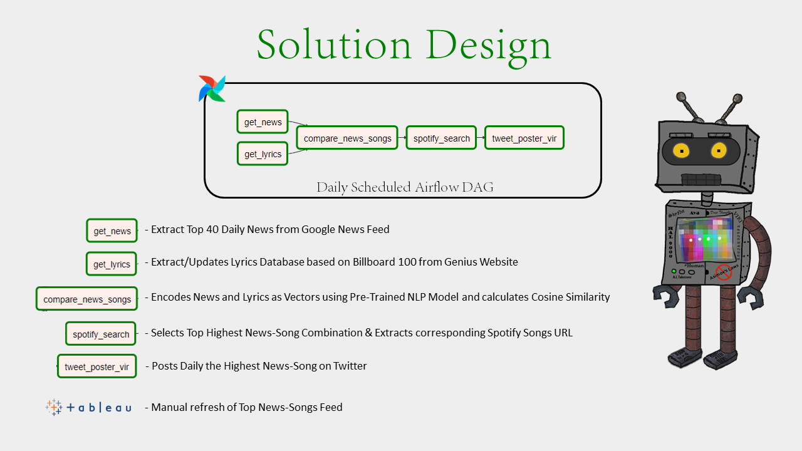

# **News Beats**
## Support Code for "AI Bot Recommends Spotify Songs Based on Daily News" 

- Posts Top Recomendation on Twitter Daily
- Runs on Airflow
- Extracts Daily News from Google News Feed
- Extracts Songs from Billboard 100, Lyrics from Genius
- Uses NLP Model to calculate News-Song Similarity
- Uses Spotify API to Extract Song URL
- Manual Feed Refresh on Tableau Dashboard

## TABLEAU Bot Feed [HERE](https://public.tableau.com/app/profile/danylo.panovyk/viz/NewsBeats/NewsBeats)
## Twitter Bot Account [HERE](https://twitter.com/AngryBruce3) 

---
# Solution Design

